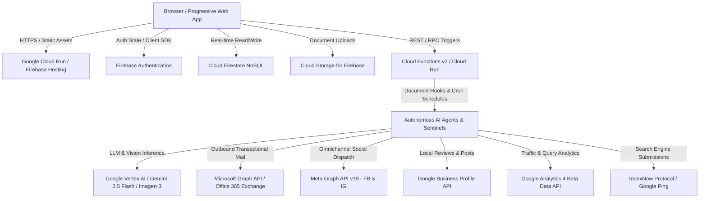
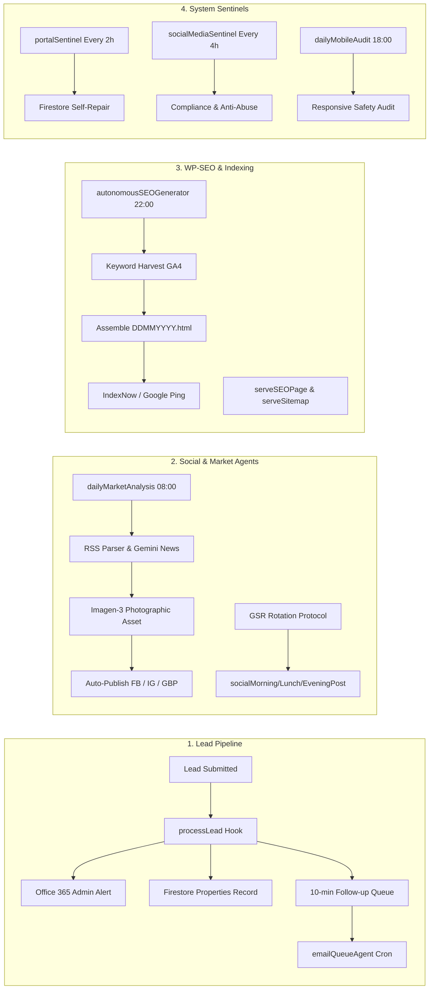

# CASH 4 HOUSES (C4H) — COMPREHENSIVE WEBSITE OPERATIONS BRIEF
**Document Classification:** Operational & Technical Architecture Reference  
**System Designation:** TAD-AMS (The Andy Decision & Automated Management System)  
**Primary Platform:** [Cash 4 Houses (cash4houses.co.uk)](https://cash4houses.co.uk)  
**Operator / Principal:** Andrew Stallard (Managing Director)  
**Target Region:** South East Essex (Southend-on-Sea, Leigh-on-Sea, Westcliff-on-Sea, Basildon, Rayleigh, Rochford, Chelmsford, etc.), London & Hertfordshire  
**Current Release Version:** 1.0.0 (Production)

---

## 1. Executive Summary & Strategic Purpose

### 1.1 Project Objective & Value Proposition
Cash 4 Houses is a proprietary, full-stack, AI-orchestrated property acquisition platform. The primary business objective is to acquire residential real estate directly from distressed or motivated UK home sellers, eliminating estate agent fees, mortgage delays, and broken property chains.

The platform provides a streamlined exit route for sellers experiencing:
- **Repossession & Mortgage Arrears**
- **Probate / Inherited Property Liabilities**
- **Divorce / Relationship Dissolution**
- **Structural Defects, Subsidence & Problem Tenancies**
- **Broken Property Chains Requiring Rapid Liquidity**

**Core Consumer Guarantee:**
- Completion in as little as 7 days.
- Guaranteed formal cash offer within 24 to 48 working hours.
- 100% of seller legal fees covered.
- Zero commissions, no survey fees, and no obligation.

### 1.2 Brand Philosophy & The "Warm Blanket" Ethos
Unlike aggressive or generic corporate cash-buying portals, Cash 4 Houses is architected around the **"Warm Blanket"** brand ethos:
- **Empathetic & Discrete:** Non-judgmental, compassionate communication acknowledging the emotional and financial strain of distressed homeownership.
- **Documentary Realism (HL-VF Protocol):** The platform rejects artificial "show-home" aesthetic tropes. Marketing assets deliberately feature authentic UK residential housing types (1930s semis, Victorian terraces, weathered brickwork, lived-in facades), establishing trust and relatable reality for sellers in distress.
- **The "Andy" Persona:** Direct representation by Andrew Stallard, presenting an accessible, honest property buyer who prioritizes the human situation over the transaction.

---

## 2. High-Level System Architecture

The Cash 4 Houses ecosystem operates on a decoupled, cloud-native architecture combining a high-performance frontend with an autonomous AI and serverless microservice backend:



### 2.1 Technology Stack Summary
| Layer | Technology | Primary Function |
| :--- | :--- | :--- |
| **Frontend Framework** | Vanilla ES6+ JavaScript, HTML5, CSS3 | Zero-overhead, lightweight rendering with maximum DOM control |
| **Build & Bundler** | Vite 8.0.4+ (`rollupOptions` MPA configuration) | Sub-second HMR and multi-page production bundling into `/dist` |
| **PWA Engine** | `vite-plugin-pwa` + Workbox | Offline caching, home screen installation, service worker lifecycle |
| **Data Visualisation** | ApexCharts.js | Real-time analytics, user heatmaps, hourly usage, and entry routes |
| **Markdown Parser** | Marked.js | Client-side rendering of AI generated articles, spotlights, and logs |
| **Backend Compute** | Firebase Cloud Functions v2 (Google Cloud Run) | Serverless microservices, background event handlers, scheduled jobs |
| **Database** | Google Cloud Firestore | Document-based real-time NoSQL database with granular security rules |
| **Identity Management** | Firebase Authentication | Role-based authentication (Admin Pinned UID vs. Public Sellers) |
| **Object Storage** | Cloud Storage for Firebase | User identity proofs, title deeds, surveyor reports, property imagery |
| **AI Framework** | Google Genkit AI (`@genkit-ai/vertexai`) | Orchestration of Gemini 2.5 Flash & Imagen-3 models |
| **SMTP / Communications** | Microsoft Graph API (`@azure/identity`) | Office 365 Exchange email dispatch via `andy@cash4houses.co.uk` |
| **Web Server (Production)**| `serve` (port 8080) | Static file server listening on `$PORT` inside Cloud Run containers |

---

## 3. Directory & File Catalog

The workspace consists of 59 core files organized across the root and dedicated functions directories:

### 3.1 Root Configuration & Infrastructure Files
- **[`package.json`](file:///c:/Antigravity%20Project/C4H%20Website/TAD-AMS/package.json):** Project manifest defining frontend scripts (`dev`, `build`, `preview`, `start`), core dependencies (`firebase`, `serve`), and dev dependencies (`vite`, `vite-plugin-pwa`).
- **[`package-lock.json`](file:///c:/Antigravity%20Project/C4H%20Website/TAD-AMS/package-lock.json):** Exact dependency lockfile for deterministic npm installs.
- **[`vite.config.js`](file:///c:/Antigravity%20Project/C4H%20Website/TAD-AMS/vite.config.js):** Configuration for Vite bundler, PWA manifest, and 21 distinct Rollup HTML entrypoints.
- **[`firebase.json`](file:///c:/Antigravity%20Project/C4H%20Website/TAD-AMS/firebase.json):** Deployment specifications for Hosting, Firestore rules/indexes, Storage rules, security headers (CSP, Permissions Policy), and Cloud Function rewrites (`serveSEOPage`, `serveSitemap`).
- **[`.firebaserc`](file:///c:/Antigravity%20Project/C4H%20Website/TAD-AMS/.firebaserc):** Project binding to Google Cloud project `c4h-wesbite`.
- **[`firestore.rules`](file:///c:/Antigravity%20Project/C4H%20Website/TAD-AMS/firestore.rules):** Fine-grained database access rules protecting leads, properties, user messages, and system audits.
- **[`firestore.indexes.json`](file:///c:/Antigravity%20Project/C4H%20Website/TAD-AMS/firestore.indexes.json):** Compound query definitions for collection ordering and time-based filtering.
- **[`storage.rules`](file:///c:/Antigravity%20Project/C4H%20Website/TAD-AMS/storage.rules):** Binary storage security policies restricting uploads to authenticated users and global admin.
- **[`.gcloudignore`](file:///c:/Antigravity%20Project/C4H%20Website/TAD-AMS/.gcloudignore) & [`.gitignore`](file:///c:/Antigravity%20Project/C4H%20Website/TAD-AMS/.gitignore):** Build exclusion lists preventing node modules, environment keys, and debug logs from deploying.
- **[`firebase-config.js`](file:///c:/Antigravity%20Project/C4H%20Website/TAD-AMS/firebase-config.js):** Firebase client initialization, SDK export bundle, and `authReady` promise resolution.

### 3.2 Public Client Web Pages & Scripts
- **[`index.html`](file:///c:/Antigravity%20Project/C4H%20Website/TAD-AMS/index.html) & [`main.js`](file:///c:/Antigravity%20Project/C4H%20Website/TAD-AMS/main.js):** Primary consumer landing page featuring lead capture forms, local business JSON-LD schema, customer reviews, process walkthrough, and the embedded Andy AI Chatbot.
- **[`contact.html`](file:///c:/Antigravity%20Project/C4H%20Website/TAD-AMS/contact.html) & [`contact.js`](file:///c:/Antigravity%20Project/C4H%20Website/TAD-AMS/contact.js):** Direct communication portal with phone links, Google Maps coordinates, opening hours, and contact form handler connected to `processContactEnquiry`.
- **[`terms.html`](file:///c:/Antigravity%20Project/C4H%20Website/TAD-AMS/terms.html), [`privacy.html`](file:///c:/Antigravity%20Project/C4H%20Website/TAD-AMS/privacy.html), [`cookies.html`](file:///c:/Antigravity%20Project/C4H%20Website/TAD-AMS/cookies.html):** Statutory legal documents detailing GDPR data handling, cookie policies, and seller terms.
- **[`sitemap.html`](file:///c:/Antigravity%20Project/C4H%20Website/TAD-AMS/sitemap.html) & [`404.html`](file:///c:/Antigravity%20Project/C4H%20Website/TAD-AMS/404.html):** Human-readable navigational directory and custom error fallback.
- **[`style.css`](file:///c:/Antigravity%20Project/C4H%20Website/TAD-AMS/style.css):** Global stylesheet with CSS custom properties, button micro-animations, glassmorphism modals, and mobile media queries.

### 3.3 Customer Portal (The Seller Hub)
- **[`dashboard.html`](file:///c:/Antigravity%20Project/C4H%20Website/TAD-AMS/dashboard.html), [`dashboard.js`](file:///c:/Antigravity%20Project/C4H%20Website/TAD-AMS/dashboard.js), [`dashboard.css`](file:///c:/Antigravity%20Project/C4H%20Website/TAD-AMS/dashboard.css):** Private seller dashboard displaying active property status (Reviewing, Formal Offer Dispatched, Legal Stage, Complete), three-way valuation comparison (Estate Agent vs. Auction vs. Cash Purchase), direct chat with Andy, and document management. Includes admin seller impersonation banner handling.
- **[`communications.html`](file:///c:/Antigravity%20Project/C4H%20Website/TAD-AMS/communications.html) & [`communications.js`](file:///c:/Antigravity%20Project/C4H%20Website/TAD-AMS/communications.js):** Historical messaging record showing email correspondence, chat exchanges, and status changes for the logged-in homeowner.
- **[`documents.html`](file:///c:/Antigravity%20Project/C4H%20Website/TAD-AMS/documents.html) & [`documents.js`](file:///c:/Antigravity%20Project/C4H%20Website/TAD-AMS/documents.js):** Customer document repository allowing secure file uploads (land registry documentation, EPC certificates, photo identification).
- **[`profile.html`](file:///c:/Antigravity%20Project/C4H%20Website/TAD-AMS/profile.html) & [`profile.js`](file:///c:/Antigravity%20Project/C4H%20Website/TAD-AMS/profile.js):** Account profile management, phone verification, and password updates.

### 3.4 Administrative Command Centre
- **[`admin.html`](file:///c:/Antigravity%20Project/C4H%20Website/TAD-AMS/admin.html) & [`admin.js`](file:///c:/Antigravity%20Project/C4H%20Website/TAD-AMS/admin.js):** Central operational console for Andrew Stallard. Provides real-time valuation lead tracking, lead status mutation, manual AI agent invocation, system alert acknowledgement, forensic logging, seller impersonation triggers, and direct multi-user chat.
- **[`enquiry-detail.html`](file:///c:/Antigravity%20Project/C4H%20Website/TAD-AMS/enquiry-detail.html) & [`enquiry-detail.js`](file:///c:/Antigravity%20Project/C4H%20Website/TAD-AMS/enquiry-detail.js):** Granular lead dossier workspace with property specs, seller reason for sale, timeline, automated valuation notes, internal communication log, and checklist tasks.
- **[`performance.html`](file:///c:/Antigravity%20Project/C4H%20Website/TAD-AMS/performance.html) & [`performance.js`](file:///c:/Antigravity%20Project/C4H%20Website/TAD-AMS/performance.js):** Analytical intelligence suite powered by ApexCharts. Tracks page impressions, peak traffic hours, marketing acquisition channels, lead conversion heatmaps, and postcode conversion rates (SS1 vs. SS9).
- **[`social.html`](file:///c:/Antigravity%20Project/C4H%20Website/TAD-AMS/social.html) & [`social.js`](file:///c:/Antigravity%20Project/C4H%20Website/TAD-AMS/social.js):** Social media operations console showing scheduled, pending, and published AI content across Facebook, Instagram, and Google Business Profile. Allows single-click instant publishing and deletion.
- **[`picture-library.html`](file:///c:/Antigravity%20Project/C4H%20Website/TAD-AMS/picture-library.html) & [`picture-library.js`](file:///c:/Antigravity%20Project/C4H%20Website/TAD-AMS/picture-library.js):** Photographic and AI asset management repository detailing prompt parameters, geographic town associations, and 30-day anti-reuse status.
- **[`library.html`](file:///c:/Antigravity%20Project/C4H%20Website/TAD-AMS/library.html) & [`library.js`](file:///c:/Antigravity%20Project/C4H%20Website/TAD-AMS/library.js):** Master record repository for market news archives, customer communication transcripts, and system alerts.
- **[`audit-log.html`](file:///c:/Antigravity%20Project/C4H%20Website/TAD-AMS/audit-log.html) & [`audit-log.js`](file:///c:/Antigravity%20Project/C4H%20Website/TAD-AMS/audit-log.js):** Immutable compliance and operational alert log ("The Regulator" self-repair reports, mobile audit warnings, security blocks).
- **[`seo-update.html`](file:///c:/Antigravity%20Project/C4H%20Website/TAD-AMS/seo-update.html):** Real-time monitoring of autonomous daily SEO page generation, IndexNow submission logs, and sitemap health.
- **[`templates-email.html`](file:///c:/Antigravity%20Project/C4H%20Website/TAD-AMS/templates-email.html) & [`templates-email.js`](file:///c:/Antigravity%20Project/C4H%20Website/TAD-AMS/templates-email.js):** Rich WYSIWYG editor for email templates (Follow-ups, Formal Cash Offers, System Signatures).
- **[`templates-docs.html`](file:///c:/Antigravity%20Project/C4H%20Website/TAD-AMS/templates-docs.html) & [`templates-docs.js`](file:///c:/Antigravity%20Project/C4H%20Website/TAD-AMS/templates-docs.js):** Document template repository for seller agreements and legal cover sheets.
- **[`spotlight.html`](file:///c:/Antigravity%20Project/C4H%20Website/TAD-AMS/spotlight.html), [`spotlight.js`](file:///c:/Antigravity%20Project/C4H%20Website/TAD-AMS/spotlight.js), [`spotlights-index.html`](file:///c:/Antigravity%20Project/C4H%20Website/TAD-AMS/spotlights-index.html), [`spotlights-index.js`](file:///c:/Antigravity%20Project/C4H%20Website/TAD-AMS/spotlights-index.js):** Public and archived landing pages for local Essex town spotlights, combining local architectural history with daily market analysis and real reviews.
- **[`auth.js`](file:///c:/Antigravity%20Project/C4H%20Website/TAD-AMS/auth.js), [`clock.js`](file:///c:/Antigravity%20Project/C4H%20Website/TAD-AMS/clock.js), [`date-helper.js`](file:///c:/Antigravity%20Project/C4H%20Website/TAD-AMS/date-helper.js):** Reusable client utilities for global authentication modals, live clock formatting, and ordinal date calculations.

### 3.5 Cloud Functions (`/functions`)
- **[`functions/package.json`](file:///c:/Antigravity%20Project/C4H%20Website/TAD-AMS/functions/package.json):** Backend dependency configuration pinned to Node 20 LTS.
- **[`functions/index.js`](file:///c:/Antigravity%20Project/C4H%20Website/TAD-AMS/functions/index.js):** Monolithic Cloud Functions v2 application (2,628 lines) containing 35+ exported microservices, automated cron jobs, and agentic workflows.

---

## 4. Deep Functional Breakdown of Autonomous Agents & Microservices

The platform's true power resides in the autonomous agentic infrastructure inside `functions/index.js`:



### 4.1 Lead Intake, Valuation & Email Automation
1. **`processLead` (`onDocumentCreated: leads/{leadId}`):**
   - Triggered immediately when a homeowner submits an address and contact details.
   - Dispatches a High-Importance email alert to `andy@cash4houses.co.uk` via Microsoft Graph API.
   - Automatically initializes a corresponding record in the `properties` collection linked to the seller's email.
   - Schedules a personalized automated 10-minute follow-up email in the `pendingEmails` collection.
2. **`emailQueueAgent` (`onSchedule: every 5 minutes`):**
   - Polls `pendingEmails` for mature emails (`sendAt <= now`).
   - Dispatches the follow-up email via Office 365, delivering the seller's personal link to establish portal access (`#signup`).
   - Marks records as `sent` or updates with error telemetry.
3. **`researchPropertyValuation` (`onRequest`):**
   - AI RICS-Qualified Property Valuer module.
   - Takes address, town, and postcode. Evaluates 0.25-mile sold comps, regional market direction, and calculates Full Open Market Value (OMV).
   - Generates a 3-tier comparative valuation: Estate Agency (100% OMV, 6-9 months), Auction (80% OMV, 8-10 weeks), and Cash Purchase (65% OMV, 7-day completion).
   - Contains a fail-safe `"limitedData"` flag if comps are insufficient.
4. **`processPurchaseEnquiry` & `processValuationRequest` (`onRequest`):**
   - High-importance email dispatchers alerting the acquisition team when a seller selects an exit option or requests an on-site visit.
5. **`processContactEnquiry` (`onRequest`):**
   - Receives general inquiries from `contact.html`, dispatches Office 365 email to Andy, and logs an entry into `communicationLogs`.

### 4.2 Andy the AI Property Buyer (Chatbot)
- **`chatbotAndy` (`onRequest`):**
  - Interactive conversational agent powered by Gemini 2.5 Flash.
  - Embodies the "Warm Blanket" persona: empathetic, discrete, honest, speaking in strict EN-UK (British English).
  - Adheres to the **Mobile-First Brevity Protocol** (short, single-sentence paragraphs optimized for small screens).
  - Enforces the **Compassionate Safeguarding Protocol**: detects personal distress or references to self-harm and immediately provides contact details for professional support organizations.
  - Includes a secondary **Sentinel Moderation AI** that audits every generated response for abusive, discriminatory, or offensive language before it reaches the client.
  - Logs all interactions into the `communications` collection.

### 4.3 Social Media Automation & The GSR Protocol
1. **Geographical Synchronization & Rotation (GSR Protocol):**
   - Operates a 24-hour regional lockdown targeting 14 South East Essex towns: Southend-on-Sea, Westcliff, Leigh-on-Sea, Shoeburyness, Rochford, Rayleigh, Basildon, Wickford, Stanford Le Hope, Brentwood, Chelmsford, Maldon, Battlesbridge.
   - Uses an exhaustive "Bucket System" ensuring each location is methodically targeted before resetting.
2. **Hyper-Realistic Documentary Photography Protocol (HL-VF):**
   - Simulates active visual audits of target towns (architectural vernacular, red brick, pebble-dash, environmental texture).
   - Generates photography via Vertex AI Imagen-3 enforcing the "Anti-Polishing Rule" (weathered masonry, faded paint, roof moss, non-branded wheelie bins).
   - Employs a 30-day anti-reuse deduplication check in `imageLibrary`.
   - Features a resilient photographic fallback library of curated real UK property imagery.
3. **Tri-Daily Scheduled Publishing:**
   - **`socialMorningPost` (09:00 GMT), `socialLunchPost` (12:00 GMT), `socialEveningPost` (18:00 GMT)**.
   - Automatically generates targeted 80-word high-conversion copy.
   - Publishes directly to Facebook Page feed, Instagram Business media container, and Google Business Profile.
4. **Daily Market News Suite:**
   - **`dailyMarketAnalysis` (08:00 GMT)**: Scrapes official RSS feeds (Bank of England, ONS GDP, Property Industry Eye, Mortgage Strategy). Synthesizes urgent property market triggers into actionable advice for distressed sellers.

### 4.4 Autonomous SEO & The WP-SEO Protocol
1. **`autonomousSEOGenerator` (`onSchedule: 0 22 * * *`):**
   - Executes nightly at 22:00 GMT.
   - Contextual Keyword Harvest: Interrogates Google Analytics 4 Beta Data API to isolate real high-intent organic search queries ("sell my property fast", "probate property sale Essex").
   - Generates a bespoke, search-optimized static HTML page for the active GSR location containing local history, market analysis, and social archives.
   - Persists the HTML to Firestore (`seoPages/{DDMMYYYY}`).
   - Pings Bing IndexNow API and Google Search Console to initiate immediate crawler indexing.
2. **`serveSEOPage` & `serveSitemap` (`onRequest`):**
   - Directly wired to Firebase Hosting rewrites (`firebase.json`).
   - Serves generated pages at `https://cash4houses.co.uk/{DDMMYYYY}.html`.
   - Generates an automated, dynamic XML sitemap containing all core pages and up to 1,000 generated SEO pages.

### 4.5 Self-Repair, Compliance & Sentinel Agents
1. **`portalSentinel` ("The Regulator", `onSchedule: every 2 hours`):**
   - Audits Firestore database integrity: automatically patches missing timestamps on leads.
   - Audits content freshness: triggers self-healing news analysis if updates are stale (>25h).
   - Audits SEO health: initiates autonomous generation if recent spotlights are absent.
   - Records an efficiency score (0–100%) and dispatches high-impact repair alerts to admin if efficiency drops below 90%.
2. **`socialMediaSentinel` (`onSchedule: every 4 hours`):**
   - Compliance auditor that checks recent social posts for thin copy, missing visual assets, and policy drift.
   - Evaluates image generation prompts against the "Real Life Clause" vs. the "Red Line Clause" (permitting structural neglect while strictly blocking hate symbols or harassment).
3. **`dailyMobileAudit` (`onSchedule: 0 18 * * *`) & `manualMobileAudit` (`onCall`):**
   - Audits responsive design parameters, verifying minimum 44px ergonomic touch targets, header crowding, and horizontal grid safety for the 65% mobile user base.
4. **`portalReadinessSentinel` (`onRequest`):**
   - Deep forensic diagnostic endpoint verifying live connectivity for Vertex AI, Meta Graph permissions (`pages_read_engagement`, `read_insights`), and Google Business Profile OAuth handshakes.

### 4.6 Analytics & Business Intelligence
1. **`getLiveVisitors` (`onRequest`):** Interrogates Google Analytics 4 API to provide real-time active users and screen page views to the admin dashboard.
2. **`getGBPInsights` (`onRequest`):** Extracts multi-daily performance metrics from Google Business Profile (Map views, Direction requests).
3. **`socialIntelligenceAgent` (`onSchedule: 0 1 * * *`):** Evaluates 14-day engagement metrics, contrasting SS1 Southend (Fast Cash pivot) vs. SS9 Leigh-on-Sea (Discreet Sale pivot), adjusting marketing strategy accordingly.
4. **`weeklyPerformanceDigest` (`onSchedule: 0 8 * * 1`):** Compiles weekly metrics and emails a formatted executive briefing to Andrew Stallard every Monday at 08:00 GMT.

---

## 5. Security Architecture, Permissions & Settings

### 5.1 Identity & Access Control
- **Global Administrator UID:** Hard-coded to `Djh7uHK2yZYHC4Ta4xhbguaCJVl1` (Andrew Stallard).
- **Client Route Guards:** Frontend views (`admin.html`, `performance.html`, `social.html`, etc.) verify the authenticated UID against `ADMIN_UID` before rendering data, instantly redirecting unauthorized visitors to `/`.
- **Seller Impersonation Feature:** Enables the administrator to safely simulate seller viewpoints by toggling `impersonate_seller` in localStorage, displaying a red safety banner with immediate exit capability.

### 5.2 Firestore Security Matrix (`firestore.rules`)
```javascript
// Security Rule Summary
match /leads/{leadId} {
  allow create: if true; // Public lead intake
  allow read, update: if isAdmin() || isEmailOwner(resource.data.email);
  allow delete: if isAdmin();
}
match /properties/{propId} {
  allow read: if isAdmin() || isEmailOwner(resource.data.ownerEmail);
  allow write: if isAdmin();
}
match /userMessages/{userId}/{document=**} {
  allow read, write: if isAdmin() || request.auth.uid == userId;
}
match /marketUpdates/{docId} {
  allow read: if true; // Public news feed
  allow write: if isAdmin();
}
match /{document=**} {
  allow read, write: if isAdmin(); // Global administrative catch-all
}
```

### 5.3 Secret Manager Key Inventory
The following secrets are provisioned in Google Cloud Secret Manager and accessed at runtime by Cloud Functions:
- **`AZURE_TENANT_ID`, `AZURE_CLIENT_ID`, `AZURE_CLIENT_SECRET`:** Microsoft Graph API app registration credentials for Office 365 Exchange mail dispatch.
- **`META_PAGE_ID`, `META_PERMANENT_PAGE_TOKEN`, `META_APP_ID`, `META_APP_SECRET`:** Meta Graph API long-lived credentials for automatic Facebook and Instagram feed updates.
- **`GBP_LOCATION_ID`, `GBP_CLIENT_ID`, `GBP_CLIENT_SECRET`, `GBP_REFRESH_TOKEN`:** Google Business Profile API OAuth credentials for multi-location local SEO postings.
- **`GA4_PROPERTY_ID`:** Google Analytics 4 property identifier for real-time reporting.

### 5.4 Content Security & Browser Headers (`firebase.json`)
The application enforces strict enterprise-grade security headers:
- `Permissions-Policy: browsing-topics=()`: Disables invasive browser ad-tracking.
- `X-Content-Type-Options: nosniff`: Prevents MIME-sniffing exploits.
- `X-Frame-Options: SAMEORIGIN`: Protects against clickjacking.
- `Content-Security-Policy`: Granular allow-list restricting script and style origins to trusted CDNs (Google Maps, Google Analytics, FontAwesome, Cloudflare).

---

## 6. Hosting, App Runtime & Rollout Infrastructure

### 6.1 Dual Hosting Configuration Explained
The project utilizes a hybrid Google Cloud Run & Firebase Hosting topology:
1. **Firebase Hosting (CDN Edge):**
   - Configured with `"public": "dist"`.
   - Handles fast, global caching of static HTML, CSS, images, and PWA assets.
   - Intercepts requests for `/*.html` and `/sitemap.xml`, routing them to Cloud Functions (`serveSEOPage` and `serveSitemap`).
2. **Google Cloud Run (`c4hwebsite`):**
   - Serves as the continuous deployment container runtime.
   - Built via Google Cloud Buildpacks directly from the source repository.
   - The production container boots using the pinned `start` script:
     ```json
     "scripts": {
       "start": "serve -s dist"
     }
     ```
   - **Critical Resolution:** Installing `serve` and establishing `"start": "serve -s dist"` resolves the container port binding issue (`PORT=8080`), ensuring Cloud Run health checks pass without precondition failures.

### 6.2 Standard Deployment Workflows
- **Production Web Build:**
  ```bash
  npm run build
  ```
- **Firebase Deployment (Hosting, Firestore & Functions):**
  ```bash
  firebase deploy
  ```
- **Selective Deployment Options:**
  ```bash
  firebase deploy --only hosting
  firebase deploy --only functions
  firebase deploy --only firestore:rules
  ```

---

## 7. Status & Operational Verification

As of **October 2026**, the Cash 4 Houses platform is fully operational:
- ✅ **Frontend:** Responsive, PWA-enabled, multi-page application with complete seller and admin suites.
- ✅ **Backend:** 35+ resilient Cloud Functions v2 and Cloud Run microservices.
- ✅ **Database & Security:** Hardened Firestore security rules, compound indexing, and zero unauthorized exposure.
- ✅ **AI Orchestration:** Gemini 2.5 Flash copy generation, Imagen-3 photographic synthesis, and safeguarding sentinels.
- ✅ **Third-Party Handshakes:** Office 365 Graph API, Meta Pages, Google Business Profile, and GA4 Data APIs verified.
- ✅ **Build & Rollout:** Container runtime configured with static web server listening on port 8080.
